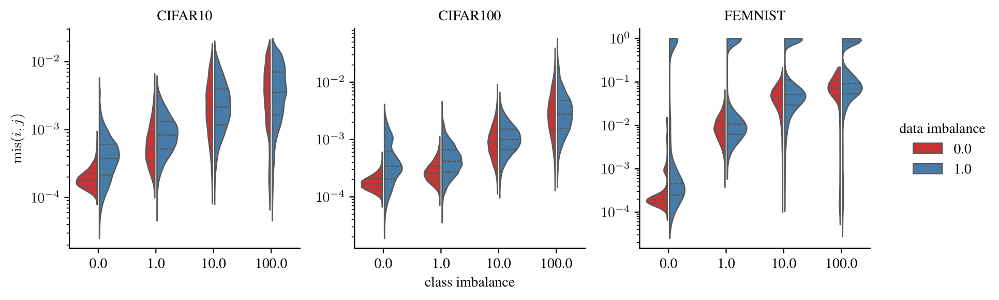
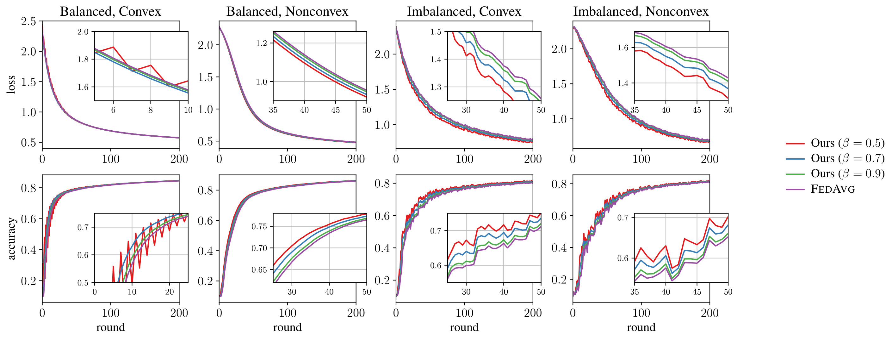

# Does Perturbation Aid Convergence? An Alternative Approach to Federated Optimization Inspired by Spectral Graph Theory

This is the codebase related to the Master's Thesis *Does Perturbation Aid Convergence? An Alternative Approach to Federated Optimization Inspired by Spectral Graph Theory* by Emanuel Buttaci (Politecnico di Torino, 2022).

## Abstract

Federated learning has emerged in the last decade as a distributed optimization paradigm due to the rapidly increasing number of devices such as user smartphones that support heavier computation to synergically train machine learning models. Since its early days, federated learning has made use of gradient-based optimization to minimize a shared loss objective across participating agents. In this respect, the statistical heterogeneity between users’ datasets has always been a conspicuous obstacle to the global convergence of the shared optimization procedure. In the first part of this thesis, we offer a different viewpoint on the matter, and we construct a graph-based model of a federated network of users to quantify the overall statistical dissimilarity between their data. Moreover, we propose an interpretation of our heterogeneity measure connected to the laplacian spectrum of the conceived graph. In the second part of our dissertation, we focus on the convergence properties of federated optimization algorithms, and we propose a novel framework where each client locally performs a perturbed gradient step leveraging prior information about other statistically similar clients. Furthermore, choosing popular algorithm `FedProx` [[4]](#4) as a baseline, we provide its convex and nonconvex convergence analysis under the smoothness assumption along with our algorithm. Therefore, we theoretically claim that our procedure, due to a minor change in the update rule, achieves a quantifiable speedup concerning the exponential contraction factor in the strongly convex case compared with the baseline. Lastly, using `FedAvg` [[3]](#3) as a term of comparison, we legitimize our conclusions through experimental results on the `CIFAR10` [[2]](#2) and `FEMNIST` [[1]](#1) datasets, where we show that our algorithm hastens convergence by a margin of 30 rounds while modestly improving generalization on unseen data in heterogeneous settings.

## Install the dependencies

Once you have the source unzipped locally, we proceed with the creation of the virtual environment for the needed dependencies.
```sh
unzip thesis-material.zip
cd thesis-material
python -m venv .env
```
This will create an isolated environment where to install the packages without conflicts with preinstalled ones at a global level. To activate the environment, run the following command depending on wether you use the classic shell of fish.
```sh
# for users with the classic shell
source .env/bin/activate
# for users with fish shell
source .env/bin/activate.fish
```
If your system has a Nvidia graphics card, then it can support the **CUDA** accelerator. Then run
```sh
pip install -r requirements.cuda.txt
```
Otherwise, use the following command
```sh
pip install -r requirements.txt
```

## Download the datasets

Once you installed the dependencies, you must download the datasets kit including

* `FEMNIST` [[1]](#1), specifically its subset with 10 classes and written digits
* `CIFAR10` and `CIFAR100` [[2]](#2)

This will allow you to directly run the experiments subsequently.
```sh
# download the archive with the datasets
gdown 1g4il9xje9bIQtYZb2352qhnbbFwFQtF4
# locally unzip it
unzip data.zip -d .
# delete the heavy archive since we will not need it anymore
rm -rf data.zip
```
All subsequent paragraphs refer to commands to be launched within the directory `thesis-material`.

## Reproduce the results from the thesis

To run the experiments (no CUDA acceleration) described throughout the thesis, run the following command.
```sh
# this script is to run 250 rounds on both FEMNIST and CIFAR10 under multiple balancedness and convexity assumptions
bash ./chapter04-simulations.sh
# this script is to run 50 rounds on both imbalanced FEMNIST and CIFAR10 with a strongly convex loss while varying the number of local epochs E
bash ./chapter04-simulations-varying-epochs.sh
# this script is to run 50 rounds on both imbalanced FEMNIST and CIFAR10 with a strongly convex loss while varying the maximum gradient norm G
bash ./chapter04-simulations-varying-gradient-norm.sh
# this script is to run 50 rounds on both imbalanced FEMNIST and CIFAR10 with a strongly convex loss while varying the step size gamma
bash ./chapter04-simulations-varying-step-size.sh
```
If your system has a CUDA driver installed, then run the same experiments using the GPU accelerator.
```sh
bash ./chapter04-simulations-cuda.sh
bash ./chapter04-simulations-varying-epochs-cuda.sh
bash ./chapter04-simulations-varying-gradient-norm-cuda.sh
bash ./chapter04-simulations-varying-step-size-cuda.sh
```
Any of these scripts will save the simulation results in the directory `simulations` as JSON files. To visualize them, it is sufficient to use the command
```sh
python chapter04-eval.py --input simulations --dataset <DATASET> --colorby algorithm --groupby balancedness+convexity
```
for each `<DATASET>` in { `femnist`, `cifar10` }. The visualizations will be saved in the directory `visualizations` as PNG files.

### Additional visualizations

The file `chapter03-auxiliary.py` allows you to visualize the results that we include in the appendix concerning the distribution of class misalignments as well as the spectra of graph laplacians in relation to multiple federated networks which are generated with different degree of heterogeneity, that is class and data imbalance.



You can simply run it as follows.
```sh
python chapter03-auxiliary.py --output ./visualizations
```

## Run your own simulations

You can also run your own experiments. The possible set of parameters is the following.

| Parameter                   	| Meaning                                      	| Possible value(s)              	| Default value 	|
|-----------------------------	|----------------------------------------------	|--------------------------------	|---------------	|
| `-d`/`--dataset`                	| Federated dataset                            	| { `femnist`, `cifar10`, `cifar100` } 	|               	|
| `-t`/`--n_iterations`           	| Number of global rounds                      	| `>= 1`                           	| `100`           	|
| `-e`/`--n_epochs`               	| Number of local epochs                       	| `>= 1`                        	| `10`            	|
| `-b`/`--batch_size`             	| Local batch size                             	| `>= 1`                           	| `256`           	|
| `-c`/`--n_agents`               	| Number of clients                            	| `>= 1`                           	| `100`           	|
| `-s`/`--step_size`              	| Step size or learning rate                   	| `> 0`                            	| `1e-3`          	|
| `-sd`/`--step_size_diminishing` 	| Enable diminishing step size                 	| { `True`, `False` }                	| `False`         	|
| `-g`/`--max_gradient_norm`      	| Clipped gradient norm                        	| `> 0`                            	| `Infinity`      	|
| `-l2`/`--l2_penalty`            	| L2 regularization weight                     	| `>= 0`                           	| `1e-4`          	|
| `-dv`/`--device`                	| Accelerator                                  	| { `cpu`, `cuda` }                  	| `cpu`           	|
| `-a`/`--algorithm`              	| Federated algorithm                          	| { `fedavg`, `fedprox`, `ours` }      	|               	|
| `-pa`/`--alpha`                 	| FedProx regularization parameter             	| `> 0`                            	| `0.1`           	|
| `-pb`/`--beta`                  	| Our algorithm's perturbation parameter       	| `> 0` and `< 1`                   	| `0.95`          	|
| `-w`/`--weighting_scheme`       	| Weights aggregation scheme                   	| { `adjacency`, `uniform` }         	|               	|
| `-di`/`--data_imbalance`        	| Heterogeneity in the distribution of samples 	| `>= 0.0`                         	| `0.0`           	|
| `-ci`/`--class_imbalance`       	| Heterogeneity in the distribution of classes 	| `>= 0.0`                         	| `0.0`           	|
| `-nc`/`--nonconvex`             	| Enable nonconvex loss instead of convex loss 	| { `True`, `False` }                	| `False`         	|
| `-r`/`--random_seed`            	| Random seed                                  	| Any integer                    	| `0`             	|
| `-L`/`--log`                    	| Enable logging metrics to JSON file          	| { `True`, `False` }                	| `False`         	|
| `-o`/`--output_directory`       	| Directory to save metrics as JSON files      	| Any string                     	| `./simulations` 	|

When a default value is not provided, it means you have to specify it. The basic syntax to run a command is
```sh
python chapter04-train.py --dataset <DATASET> --algorithm <ALGORITHM> --weighting_scheme <SCHEME> <...other parameters>
```
More details about the parameters and their meaning can be found in the `chapter04-train.py` file. Note that by specifying the `--log` flag, the metrics of the simulation (training and testing accuracy and loss) will be written to a JSON file inside the `--output_directory` directory. The JSON file also contains the metadata concerning the parameters used to launch the simulation.

### Examples

The following command runs a simulation with `FedAvg` optimization algorithm on the `FEMNIST` dataset. Moreover, the partitioning among clients is IID, namely no heterogeneity, and the loss is strongly convex, that is a multinomial logistic regression. In addition, we set the number of rounds to 200, the local epochs to 1 and the aggregation scheme to `Adjacency`.
```sh
python chapter04-train.py --dataset femnist \
    --n_iterations 200 \
    --n_epochs 1 \
    --algorithm fedavg \
    --weighting_scheme adjacency \
    --output_directory simulations \
    --log
```
This other commands runs a simulation with our algorithm and algorithm-specific parameter `beta = 0.75` on the `CIFAR10` dataset. In addition, after tweaking some self explanatory parameters, we introduce heterogeneity into the partiting of the dataset by setting `data_imbalance` and `class_imbalance` parameters as nonzero. Since the loss is specified as nonconvex, the simulation employs a simple neural network with one hidden layer and ReLU activation. Finally, we change set the step size and we enable clipping the norm of the gradient.
```sh
python chapter04-train.py --dataset cifar10 \
    --n_iterations 200 \
    --n_epochs 10 \
    --algorithm ours \
    --beta 0.75 \
    --weighting_scheme adjacency \
    --nonconvex \
    --step_size 1e-2 \
    --max_gradient_norm 10.0 \
    --class_imbalance 100 \
    --data_imbalance 1 \
    --output_directory simulations \
    --log
```

### Usage of CUDA accelerator

If your system supports a Nvidia graphics card and you have CUDA drivers installed, we suggest running all simulations with the flag `--device cuda`. In particular, when using `--nonconvex`, it becomes computationally intensive to run the simulations without CUDA acceleration. 

## Visualize the results

Once you have run some simulations, you can use `chapter04-eval.py` to visualize the results of your experiments. If you have Latex installed on your system, running `chapter04-eval.latex.py` will instead create nicer images like the ones in the thesis.



This is the set of possible parameters.

| Parameter         	| Meaning                                               	| Possible value(s)                                                      	| Default value    	|
|-------------------	|-------------------------------------------------------	|------------------------------------------------------------------------	|------------------	|
| `-d`/`--dataset`      	| Federated dataset to be selected                      	| { `femnist`, `cifar10`, `cifar100` }                                         	|                  	|
| `-m`/`--metric`      	| Metric(s) to display along the row                      	| { `accuracy`, `loss`, `loss+accuracy` }                                         	|         `loss+accuracy`         	|
| `-g`/`--groupby`      	| Criterion to split visualizations                     	| { `balancedness`, `convexity`, `balancedness+convexity`, `algorithm`, `epochs`, `max_gradient_norm`, `step_size` } 	|                  	|
| `-c`/`--colorby`      	| Criterion to color visualizations (and create legend) 	| { `balancedness`, `convexity`, `balancedness+convexity`, `algorithm`, `epochs`, `max_gradient_norm`, `step_size` } 	|                  	|
| `-p`/`--partition`    	| Specify whether to use training or testing metrics    	| { `training`, `testing` }                                                  	| `testing`          	|
| `-y`/`--same_y_scale` 	| Use same y scale                                      	| { `True`, `False` }                                                        	| `False`            	|
| `-G`/`--grid` 	| Show grids                                      	| { `True`, `False` }                                                        	| `False`            	|
| `-i`/`--input`        	| Directory from where JSON simulations are loaded      	| Any string                                                             	| `./simulations`    	|
| `-o`/`--output`       	| Directory where to save PDF visualizations            	| Any string                                                             	| `./visualizations` 	|

The most basic syntax is
```sh
python chapter04-eval.py --dataset <DATASET> --groupby <GROUPBY> --colorby algorithm <...other parameters>
```

### Examples

The following command will visualize the simulations within the `./simulations` directory for the `FEMNIST` dataset, and it will group them by (balancedness, convexity) on the rows and by default metric (either loss or accuracy) on the columns.
```sh
python chapter04-eval.py --input ./simulations --output ./visualizations --dataset femnist --groupby balancedness+convexity
```
Instead, this other command is similar to the first, but additionally colors line differently according to the employed algorithm, for which it creates a legend.
```sh
python chapter04-eval.py --input ./simulations --output ./visualizations --dataset femnist --groupby balancedness+convexity --colorby algorithm
```

## Read the documentation related to the fedbox package

We created the `fedbox` package to perform the simulations associated to the aforementioned thesis. 
Run the following command inside the same directory as before to read the HTML documentation in your preferred browser.
```sh
# if you have google chrome
google-chrome docs/index.html
# if you have firefox
firefox docs/index.html
```
This will display the documentation hierarchically in relation to the content of the package.

## References

<a id="1">[1]</a> 
Caldas, S., Wu, P., Li, T., Konecný, J., McMahan, H.B., Smith, V., & Talwalkar, A. (2018). LEAF: A Benchmark for Federated Settings.

<a id="2">[2]</a> 
Krizhevsky, A. (2009). Learning Multiple Layers of Features from Tiny Images.

<a id="3">[3]</a> 
McMahan, H. B. et al. (2016). Communication-Efficient Learning of Deep Networks from Decentralized Data.

<a id="4">[4]</a> 
Sahu, Anit Kumar et al. (2018). Federated Optimization in Heterogeneous Networks.
